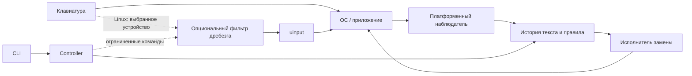
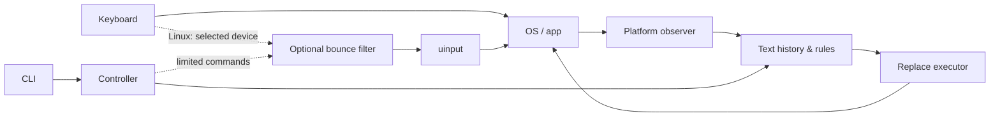

# TypeTune

<p align="center">
  
</p>

<p align="center">
  <strong>Помощник ввода: Double Shift исправляет ошибочную RU/EN раскладку</strong>
</p>

<p align="center">
  <a href="#english">English</a> ·
  <a href="docs/35-user-test.md">Быстрый старт</a> ·
  <a href="docs/17-validation-record.md">Проверки</a> ·
  <a href="docs/13-target-architecture.md">Архитектура</a>
</p>

<p align="center">
  <a href="LICENSE"></a>
  <a href="https://www.rust-lang.org/"></a>
  <a href=".github/workflows/ci.yml"></a>
  
  
</p>

---

Набрали `ghbdtn` вместо `привет`? Дважды коротко нажмите **один Shift** —
TypeTune исправит последнее слово и переключит раскладку дальнейшего ввода.

```text
  US-layout typing     Double Shift      result
  ─────────────────    ────────────      ──────
  ghbdtn            →      ⇧ ⇧        →  привет
  руддщ             →      ⇧ ⇧        →  hello
```

Это **не транслитерация**. TypeTune сопоставляет физические клавиши двух
конкретных раскладок (US ↔ RU) и сохраняет регистр.

> **Статус:** экспериментальный preview для **GNOME 50 / Wayland**.
> Windows, macOS и другие Linux desktop-среды ещё не приняты.

## Как это работает

| Жест | Что происходит |
|---|---|
| **Double Shift** | Исправляет текущее/последнее слово и меняет язык дальнейшего ввода |
| **Повторный Double Shift** | Переключает то же слово обратно: `ghbdtn → привет → ghbdtn → привет` |
| **Пробел** | Консервативная автокоррекция по встроенному словарю (4091 RU / 4053 EN) |

Ручная коррекция предсказуема: без достоверной истории текста замена не выполняется.
Автокоррекция срабатывает только при высокой уверенности (известное целевое слово,
отсутствие URL/кода/смешанного алфавита, поддержанный профиль).

## Режимы

| Режим | Механизм | Границы |
|---|---|---|
| **Совместимость** (`compat-on`) | Пассивный evdev + виртуальная клавиатура uinput, без exclusive grab | Не ограничен списком приложений. Подтверждён браузерный сценарий; текст/выделение/пароль/composition полностью не проверены |
| **IBus** (`browser` / `start`) | Общий Rust engine + IBus, контекст GNOME; AT-SPI для части приложений | Ограниченные профили Chrome и GNOME Text Editor |

Режимы не работают одновременно. Отправка клавиш не гарантирует одинаковое
поведение во всех программах: терминалы, игры и нестандартные поля могут
обрабатывать их иначе.

## Установка

Нужны Rust/Cargo, системные зависимости workspace и Python GI.
Подробности — в [инструкции пользователя](docs/35-user-test.md).

```sh
./scripts/typetune-test install
# После установки/обновления расширения: выйти из GNOME и войти снова.
./scripts/typetune-test compat-on
```

В US-раскладке наберите `ghbdtn` в пустом поле и дважды коротко нажмите Shift.
Ожидается `привет` и русский ввод.

Режим совместимости требует доступа к `/dev/input` и `/dev/uinput` —
установщик эти права автоматически не выдаёт. Перед паролями и важными
терминальными командами приостанавливайте коррекцию.

## Управление

```sh
./scripts/typetune-test pause        # приостановить (пароли, важные команды)
./scripts/typetune-test resume
./scripts/typetune-test auto-off     # оставить только ручной жест
./scripts/typetune-test auto-on
./scripts/typetune-test status
./scripts/typetune-test compat-off
./scripts/typetune-test stop         # остановить любой активный режим
```

## Архитектура

Физический фильтр клавиш и работа с текстом разделены. В штатном режиме
буквы сразу получает приложение; TypeTune хранит ограниченную историю
наблюдений и заменяет уже введённый фрагмент при подтверждённом совпадении.



Модульность (Rust workspace):

| Crate | Роль |
|---|---|
| `typetune-core` | Доменные типы, capabilities, идентификаторы |
| `typetune-engine` | История текста, приоритет правил, планы замен |
| `typetune-corrector` / `typetune-snippets` | Чистые правила коррекции и сниппетов |
| `typetune-input` / `typetune-inject` / `typetune-ibus` | Linux-адаптеры |
| `typetune-cli` / `typetune-config` | Управление и конфигурация |

Подробнее — [целевая архитектура](docs/13-target-architecture.md).

## Проверки

```sh
cargo test --workspace --all-targets --locked --offline
/usr/bin/python3 -m unittest discover -s integrations/compat -p 'test_*.py'
/usr/bin/python3 -m unittest discover -s integrations/ibus -p 'test_*.py'
```

Границы доказательств и native-стенды — в
[протоколе проверок](docs/17-validation-record.md).

## Документация

| Документ | О чём |
|---|---|
| [Установка и пользовательская проверка](docs/35-user-test.md) | Как запустить и что ожидать |
| [Протокол проверок](docs/17-validation-record.md) | Что реально работало и границы |
| [Архитектура](docs/13-target-architecture.md) | Контракты компонентов и событий |
| [Спецификация продукта](docs/16-product-spec.md) | Поведение функций и приоритеты |
| [План развития](docs/14-development-plan.md) | Фазы и критерии готовности |
| [Espanso reference](docs/15-espanso-reference.md) | Архитектурный ориентир (код не копировался) |

Наличие модулей GUI/tray/packaging/snippets в дереве **не** означает их
готовность в preview. Аудиты [Linux](docs/11-linux-audit.md) и
[функций](docs/12-feature-audit.md) описывают исторический baseline `8cc19d0`.

## Roadmap (кратко)

- [x] Double Shift + повторное переключение слова/раскладки
- [x] Консервативная автокоррекция на пробеле
- [x] Compatibility backend (evdev/uinput) и ограниченный IBus-профиль
- [ ] Качественные словари с provenance и corpus tests
- [ ] Сниппеты, pause/doctor UX, application profiles
- [ ] Windows / macOS adapters

## Лицензия

[MIT](LICENSE) © 2026 Kartamyshev

Код Espanso не копировался; заимствуются только проверенные архитектурные
принципы ([reference](docs/15-espanso-reference.md)).

---

# English

<p align="center">
  <a href="#typetune">Русская версия ↑</a>
</p>

<p align="center">
  <strong>Keyboard helper: Double Shift fixes accidental RU/EN layout mistypes</strong>
</p>

TypeTune corrects words you typed with the wrong keyboard layout.
Double-tap **Shift** and the last word is rewritten — `ghbdtn` becomes
`привет` — while the input language switches to match.

This is **not transliteration**: physical key positions are mapped between
two concrete layouts (US ↔ RU), preserving case.

> **Status:** experimental preview for **GNOME 50 / Wayland**.
> Windows, macOS, and other Linux desktops are not accepted yet.

## Features

| Gesture | Behaviour |
|---|---|
| **Double Shift** | Corrects the last word and switches the following input language |
| **Repeat Double Shift** | Toggles the same word back: `ghbdtn → привет → ghbdtn → привет` |
| **Space** | Conservative auto-correction from the built-in dictionary (4091 RU / 4053 EN) |

Manual correction is predictable: without a trustworthy text history,
nothing is deleted. Auto-correction only fires on high confidence
(known target word, no URL/code/mixed-script, supported profile).

## Modes

| Mode | Mechanism | Limits |
|---|---|---|
| **Compat** (`compat-on`) | Passive evdev + virtual uinput keyboard, no exclusive grab | Not app-list limited. Browser scenario confirmed; text/selection/password/composition not fully verified |
| **IBus** (`browser` / `start`) | Shared Rust engine + IBus, GNOME context; AT-SPI for some apps | Limited Chrome and GNOME Text Editor profiles |

Modes are mutually exclusive. Injected keys are not guaranteed to behave
identically in every application.

## Install

Requires Rust/Cargo, workspace system deps, and Python GI.
See the [user guide](docs/35-user-test.md) for details.

```sh
./scripts/typetune-test install
# After installing/updating the extension: log out of GNOME and back in.
./scripts/typetune-test compat-on
```

Type `ghbdtn` in an empty field on the US layout, then double-tap Shift.
You should see `привет` and Russian input.

Compat mode needs access to `/dev/input` and `/dev/uinput`; the installer
does not grant these automatically. Pause correction before passwords and
critical shell commands.

## Architecture

Physical key filtering and text work are separate. Normal typing reaches
the application immediately; TypeTune keeps a bounded observation history
and rewrites already-typed text on a confirmed match.



See the [target architecture](docs/13-target-architecture.md) for module
contracts and event shapes.

## Testing

```sh
cargo test --workspace --all-targets --locked --offline
/usr/bin/python3 -m unittest discover -s integrations/compat -p 'test_*.py'
/usr/bin/python3 -m unittest discover -s integrations/ibus -p 'test_*.py'
```

What was actually verified — and the limits of that evidence — lives in the
[validation record](docs/17-validation-record.md).

## License

[MIT](LICENSE) © 2026 Kartamyshev

Espanso code was not copied; only verified architectural principles are
referenced ([notes](docs/15-espanso-reference.md)).
