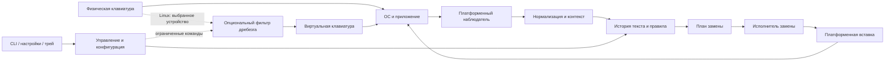

# Целевая архитектура TypeTune

Текущий Linux preview после [этапа 54](54-remove-ibus.md) использует только evdev/uinput compatibility; IBus-адаптер удалён. Прежние исследования сохраняются как история.

Статус: целевые контракты, частично реализованные Linux-preview; актуальный статус — в checkpoints 53–55. План портов — [56](56-cross-platform-roadmap.md). Основание: аудит ревизии `8cc19d0` от 2026-09-10. Этот документ заменяет прежнюю архитектуру единого `evdev → Vec<InputEvent> → uinput` для всех функций.

## 1. Решение и его границы

Сохранить Rust, workspace и полезную предметную логику, но разделить два разных вида обработки:

1. **Обработка физических клавиш**: опциональный Linux-фильтр дребезга с ограниченным временем обработки, идентичностью устройства и сохранением состояния клавиш.
2. **Работа с текстом**: движок в пользовательской сессии, наблюдающий ввод, предлагающий замену и выполняющий её через доступный платформенный способ.

Для исправления раскладки и сниппетов эксклюзивный захват всей клавиатуры не нужен как обязательная основа. В штатном режиме буквы сразу получает приложение. TypeTune хранит ограниченную историю наблюдений; при подтверждённом совпадении заменяет уже введённый фрагмент. Это исключает противоречие старого плана: «не передать слово приложению, затем удалить его».

Кроссплатформенность означает общее поведение там, где ОС предоставляет необходимые возможности. Она не означает одинаковый низкоуровневый API и одинаковые гарантии на любой ОС, в любом приложении и композиторе.

## 2. Компоненты и потоки данных



Пунктирный путь заменяет прямой путь выбранного устройства только после успешной подготовки фильтра. Это альтернативные маршруты, а не двойная доставка. Наблюдатель видит один логический поток. Если Linux-наблюдатель использует evdev, он выбирает либо физический источник, либо очищенный поток фильтра; одновременное чтение физического и зеркального устройства запрещено.

### Предлагаемая ответственность модулей

| Модуль | Ответственность | Запрещённые зависимости |
|---|---|---|
| `typetune-core` | Типы доменных событий, capabilities, идентификаторы, часы, результаты | GTK, D-Bus, evdev, Win32, AppKit |
| `typetune-engine` — новый | История текста, приоритет правил, планирование и отмена замен | Прямые вызовы ввода ОС, shell, сеть |
| `typetune-corrector` | Чистая функция: контекст/слово → кандидат коррекции | Генерация keycodes, захват устройств |
| `typetune-snippets` | Компиляция триггеров, поиск, шаблоны без побочных эффектов | Синхронный запуск процессов в обработчике |
| `typetune-chatter` | Автомат состояния физических клавиш | Unicode, словари, GUI |
| `typetune-config` | Схема, defaults, валидация, миграции | Управление живыми устройствами |
| Платформенные адаптеры | Capture, layout, context, injection, clipboard, lifecycle | Предметные правила корректора и сниппетов |
| Linux input helper | Минимальный доступ к выбранным устройствам, forwarding, heartbeat | Текстовые правила, shell, загрузка плагинов |
| Пользовательский runtime | Очереди, конфигурация, worker для шаблонов, управление заменами | Обязательные root-права |
| CLI / UI | Отображение фактического статуса, настройка, диагностика | Владение захватом клавиатуры |

Не обязательно создавать все новые crates сразу. Сначала закрепить границы модулями и тестами. `typetune-input`, `typetune-inject`, `typetune-layout` можно постепенно превратить в Linux-адаптеры. Не писать собственные копии Win32/macOS API в общем ядре.

## 3. Контракт событий

Нынешний `InputEvent { keycode: u32, state: Pressed|Released, character: Option<char> }` недостаточен. Смешиваются физическая клавиша, её символ и команда редактирования.

### 3.1. Физическое событие

Проектная схема, не существующий Rust API:

```text
PhysicalKeyEvent {
  device_id: DeviceId | Unknown,
  seat_id: SeatId,
  native_code: EvdevCode | X11Code | WindowsScanCode | MacKeyCode,
  physical_key: PhysicalKey | Unknown,
  action: Down | Up | Repeat,
  source_time: MonotonicTime,
  observed_time: MonotonicTime,
  sequence: u64,
  frame_id: optional FrameId,
  origin: Physical | HardwareRelay(device_id, generation)
          | TextInjection(transaction_id) | OtherSynthetic | Unknown,
  modifiers: ModifierSnapshot,
  layout_generation: Generation
}
```

У каждого code-типа явное пространство значений. В Linux evdev → uinput передаётся исходный код. Преобразование `evdev + 8` находится только на границе XKB; обратное преобразование применяется только к значению типа XKB/X11. Никакой «поправки 8» в общем pipeline. В kernel-протоколе значения `EV_KEY` 0, 1 и 2 имеют разные значения; точный контракт см. в [документации Linux](https://docs.kernel.org/input/event-codes.html#ev-key).

Время источника не заменяется временем обработки пакета. Адаптер нормализует часы, маркирует разрывы и не делает арифметику между разными clock domains. Таймеры движка инъецируются в тестах; `sleep` не служит механизмом упорядочения.

### 3.2. Наблюдение текста

```text
TextObservation {
  kind: Insert(text) | DeleteBackward(unit) | Boundary | Reset(reason),
  evidence: Committed | KeymapInferred,
  context_epoch: u64,
  target: optional TargetId,
  layout: Known(layout_id, generation) | Unknown,
  composition: Inactive | Active | Unknown,
  origin,
  source_sequence
}
```

`String`, а не `char`: одно действие может дать несколько Unicode code points; dead key может пока не дать текста. Key-up не создаёт ещё одну букву. Ctrl/Alt/Meta-команды, navigation и paste не интерпретируются как обычное печатание. AltGr отличается от обычного shortcut, если backend способен это установить.

Глобальный keyboard hook обычно позволяет лишь восстановить предполагаемый текст. Это не доказательство, что поле его приняло. `Committed` допустим только при подтверждении от интеграции текстового ввода или контролируемого редактора. Для остальных используется `KeymapInferred` и более узкая область совместимости.

### 3.3. Контекст и возможности

```text
ContextSnapshot {
  epoch, target_id, application_id,
  field_sensitivity: Normal | Sensitive | Unknown,
  focus: Known | Unknown,
  selection: NoneKnown | Present | Unknown,
  composition, layout,
  capabilities, captured_at
}
```

Возможности задаются независимо: `observe_keys`, `observe_committed_text`, `identify_device`, `suppress_keys`, `read_layout`, `read_focus`, `detect_sensitive_field`, `replace_range`, `inject_unicode`, `inject_keys`, `clipboard_paste`, `global_shortcut`. Для каждой — `available`, `unavailable(reason)` или `limited(scope)`. Наличие Wayland/X11 по переменной окружения не заменяет probing.

Отсутствие возможности — результат, а не пустая строка. Исключение для приложения нельзя считать соблюдённым, если backend не знает активное приложение. При `Unknown` автоматическая разрушительная замена отключена по умолчанию. Для явно включённого пользователем ограниченного профиля требуется документированная область действия и live-проверка; это не глобальная гарантия защиты всех полей.

### 3.4. Матрица допуска замены

Ручной shortcut разрешает запрос, но не отменяет обязательные guards. Копирование готового результата через UI без изменения чужого приложения остаётся допустимым fallback.

| Неизвестное/ограниченное свойство | Автоматическая замена | Ручная замена с удалением |
|---|---|---|
| Target/focus неизвестен или epoch изменился | Запрет | Запрет |
| Expected suffix/последовательность недостоверны | Запрет | Запрет; предложить скопировать результат |
| Selection неизвестна | По умолчанию запрет; только проверенный профиль с контрактом непрерывного ввода и сброса на selection/navigation | Требуется тот же контракт либо достоверный range API |
| Sensitive field известен | Не накапливать историю; запрет | Не использовать историю этого поля |
| Sensitivity неизвестна | По умолчанию без истории/замен; разрешён только явно включённый limited app profile с известным target | Такой же limited profile; shortcut сам по себе не разрешает глобальное накопление |
| Composition активна/неизвестна | Запрет предположительных text actions | Запрет удаления по keymap-inferred истории; проверенный committed/range adapter — отдельная capability |
| Layout неизвестен | Нет коррекции и keymap-inferred matching | Нет коррекции по предположительной карте; готовый Unicode-сниппет из UI не нуждается в такой карте, но остальные guards обязательны |
| Вставка Unicode недоступна | Запрет до удаления | Запрет до удаления; fallback копирования |

Limited app profile не превращает неизвестное значение в `Known`: в статусе сохраняются ограничение и основание разрешения. Расширять эти исключения можно только с отдельным acceptance case. Tests проверяют конкретное свойство, а не один общий флаг `Unknown`.

## 4. История текста и правила

История хранится только в RAM, отдельно для текущего context epoch. Ограничить её, например, 256 графемами; точный лимит — конфиг с верхней границей. Не сохранять весь набранный текст и не логировать исходное/исправленное слово в обычные журналы.

Очистить историю и pending-планы при смене фокуса, клике/перемещении каретки, неизвестном редактировании, изменении выделения, paste, undo приложения, layout/keymap change, composition, lock, потере доступа, пропуске очереди, disable и reload несовместимых правил. Если backend не умеет наблюдать нужное изменение контекста, он не получает полную поддержку автоматической замены.

Порядок работы:

1. Адаптер пропускает обычный ввод и публикует наблюдение.
2. Engine проверяет origin, контекст и полноту последовательности.
3. Обновляет shadow-историю уже доставленного или предположительно доставленного текста.
4. Вычисляет кандидатов: ручная команда → точный сниппет → коррекция раскладки → типографика.
5. Арбитр выбирает **одну** замену для одного диапазона; результаты одной функции не запускают следующую рекурсивно.
6. Исполнитель получает план с snapshot/generation и перепроверяет его перед изменением приложения.

Приоритеты выше — проектное решение. Конфликт точного сниппета и корректора должен иметь фиксированный тест. Правила не вызывают друг друга через синтетические key events.

## 5. Замена текста как ограниченная операция

```text
ReplacementPlan {
  transaction_id,
  context_epoch, target_id, config_generation, layout_generation,
  source_span: { expected_suffix, evidence, deletion_strategy },
  replacement: String,
  boundary: { text, already_delivered },
  modifier_policy,
  requested_by: User | AutomaticRule,
  deadline
}
```

`expected_suffix` хранится в памяти. Длина в байтах, число символов, графем и нажатий Backspace — разные величины. Backend определяет допустимую deletion strategy. Без надёжного range API начальная поддержка ограничивается обычным текстом в проверенных полях; emoji, combining marks, IME и сложные редакторы не «чинятся» формулой `chars().count()`.

Состояния исполнителя: `Prepared → Validated → Applying → Completed` либо `Cancelled / FailedBeforeEdit / IndeterminateAfterEdit`. Последний результат обязателен: отправка событий ОС не подтверждает изменение документа в приложении.

### Последовательность

1. Полностью отрендерить replacement, проверить размер и доступный способ вставки **до удаления** исходного фрагмента.
2. Проверить focus/context epoch, поколения конфигурации и layout, модификаторы, отсутствие composition, ожидаемый суффикс и deadline. Неизвестный target не подменять последним известным.
3. Зарезервировать одну операцию на seat. Observer-only backend может задержать наблюдения, но не физический ввод в приложение. Ограниченная очередь именно физического ввода допустима только с проверенным `suppress_keys` и парным воспроизведением Down/Up. Без suppression/range transaction новое пользовательское редактирование до первого edit отменяет план; после первого edit останавливает дальнейшие команды и даёт `IndeterminateAfterEdit`. Уже отправленную пачку событий отозвать нельзя. Не объявлять очередь наблюдений защитой от interleaving.
4. Использовать replace-range API там, где его контракт известен; иначе проверенную последовательность удаления суффикса и вставки. Нажатия удалений формируются backend-ом, а не matcher-ом.
5. Разделитель учесть ровно один раз. В режиме наблюдения при вводе `ghbdtn ` приложение уже содержит и слово, и пробел: заменяем суффикс `ghbdtn ` на `привет `. Если другой backend кратко удерживает delimiter, это отдельный контракт, не неявное изменение числа Backspace.
6. Пометить собственную вставку и не допустить повторного запуска правил. Снять ограничение обработки даже при ошибке.
7. Завершить операцию, обновить историю по известному результату либо сбросить её. При частичном результате не повторять Backspace/вставку автоматически.

Проверка фокуса перед вставкой уменьшает риск, но не делает последовательность атомарной относительно чужого приложения. Без транзакционного API нельзя обещать универсальный rollback. Undo TypeTune предлагается лишь пока известны тот же target, суффикс и отсутствие последующего редактирования; иначе применяется обычный undo редактора вручную.

В observer MVP автоматический delimiter — **Space**. Enter и Tab могут отправить сообщение, выполнить команду или сменить поле даже без надёжного события смены target. Их нельзя считать вставленными `\n`/`\t` по одному keycode. Поддерживать их только при подтверждённой текстовой вставке в том же поле либо отдельном backend-контракте удержания action-key до решения; иначе сбрасывать историю без замены.

### Вставка Unicode

Общий контракт принимает строку Unicode. Ручная таблица `char → физическая клавиша` не является текстовым backend-ом: буква зависит от активной раскладки и модификаторов. Смена системной раскладки и исправление текста — две отдельные операции; исправление не должно скрыто менять раскладку.

Предпочтение backend-ов выбирается по возможностям конкретного приложения: native text API, проверенная Unicode injection, clipboard paste, ограниченная keymap-based вставка. Не объявлять Ctrl+Shift+U универсальным Linux-способом.

Clipboard-путь — опциональный. Проверять поддержку форматов, владение/sequence, доступность paste и завершение transfer. Восстанавливать предыдущее содержимое только если clipboard всё ещё принадлежит этой операции; новое пользовательское содержимое не перезаписывать. Фиксированная задержка сама по себе не доказывает, что приложение прочитало clipboard. Если backend не может определить завершение, его профиль явно ограничен. Содержимое clipboard не сохранять на диск.

### Защита от циклов

Использовать native synthetic flags/tags, где они доступны, и ledger собственных операций. Различать собственное **зеркало физических клавиш** `HardwareRelay` и **текстовую вставку** `TextInjection`. Helper никогда не захватывает свои виртуальные устройства повторно. Text observer принимает ровно один доверенный physical-derived поток relay и исключает transaction output. Роли устройств/потоков регистрируются по identity/generation или согласованному IPC, а не только по имени или признаку synthetic. Если backend не умеет различать их, совместный режим не объявляется поддержанным.

Временное отключение matcher-а — дополнительная защита, но оно не должно безусловно выбрасывать физический ввод пользователя. `OtherSynthetic` и `Unknown` по умолчанию не запускают автоматические правила. Synthetic flag сам по себе не причина отбросить доверенное зеркало anti-chatter.

## 6. Linux: два независимых backend-направления

### 6.1. evdev/uinput helper для anti-chatter

Helper имеет ограниченную роль: открыть разрешённые устройства, проверить доступ и capabilities, подготовить виртуальное устройство, синхронизировать состояние, затем захватить выбранный источник. Если output не готов, захвата быть не должно. Использовать проверенную библиотеку evdev/libevdev или аккуратные bindings; возвращаться к raw ioctl только при документированном пробеле API и ABI-тестах. [Linux рекомендует libevdev для uinput](https://docs.kernel.org/input/uinput.html).

Обязательные свойства:

- Идентичность устройства по udev/sysfs и доступным стабильным атрибутам; `/dev/input/event9` не конфигурационный идентификатор. `Unknown` допустим и видим в диагностике.
- Hotplug, отключение, Bluetooth reconnect, suspend/resume и seat/session lifecycle обрабатываются событиями.
- Поддерживаемые key capabilities зеркалируются без искусственной границы 255. Для смешанных устройств заранее определить поддержку дополнительных типов; если их нельзя прозрачно передать, не захватывать такое устройство.
- Сохраняется frame semantics; `SYN_DROPPED` вызывает resync, а не продолжение со старым состоянием. Потерянную историю ввода восстановить нельзя; можно восстановить только текущее состояние.
- `Down/Up/Repeat` сохраняют смысл. В initial relay выбрать один источник repeat: зеркалировать kernel repeat вместе с необходимой конфигурацией либо генерировать его в одном месте; не оба одновременно.
- Для каждой физической клавиатуры отдельное виртуальное зеркало — базовый вариант. Если выбран один общий output, обязателен refcount владельцев удержания `(device, key)`; отпускание Shift на одной клавиатуре не отпускает Shift другой.
- Учёт физически удержанных и выданных в output клавиш разделён. При отключении освобождаются только соответствующие виртуальные удержания.
- Запуск при удержанном Shift/Ctrl требует resync или ожидания нейтрального состояния; ungrab/падение не гарантирует восстановление уже потерянных нажатий.
- Проверяются полные записи, `EINTR`, `EAGAIN`, disconnect и лимиты очереди. Ошибка output не завершается одним логом при продолжающемся grab.

Fail-open здесь означает «прекратить захват и дать будущему физическому вводу идти в ОС», а не «никогда не потерять символ». При ошибке consumer-а helper продолжает identity forwarding; при отказе output освобождает grab. Watchdog и ограниченные таймауты обязаны работать независимо от text worker/UI. Закрытие fd при гибели процесса освобождает grab, но это не спасает от зависшего живого процесса и не компенсирует предыдущее состояние. Проверить оба сценария отдельно.

Привилегии выдаются helper-у/выбранным устройствам по проверенному механизму установки; не всему GUI/runtime. Авторизация локального IPC привязана к пользователю и активной сессии. Не выдавать root runtime-у со сниппетами. Отказ/отзыв разрешения возвращает typed status и отключает функцию. Автозапуск в greeter/lock screen не является областью text engine.

### 6.2. X11

Выделить observation, XKB state/keymap, focused application и injection в независимые адаптеры. XRecord/XInput2 — кандидаты наблюдения; XTest — кандидат клавишной инъекции; окончательный выбор после вертикального прототипа и проверки repeat/modifiers/focus. Интеграция Espanso рассматривается в [отчёте](15-espanso-reference.md).

XKB keymap и group брать из живой X-сессии, отслеживать смену map/state; статический `us,ru` не доказывает текущую раскладку. X11 не гарантирует знание текста, выделения и чувствительности каждого виджета: full-range replacement и чувствительные поля требуют дополнительных возможностей или ограниченного профиля приложения.

XWayland-возможности относятся только к обслуживаемым XWayland-приложениям. Наличие `$DISPLAY` в Wayland-сессии не означает глобального X11-доступа к native Wayland приложениям.

### 6.3. Wayland: обязательный ранний прототип

Обычный `wl_keyboard` описывает ввод для фокуса клиента, а не универсальное фоновое наблюдение. Создание собственного xkb state не даёт состояние клавиатуры чужого приложения. См. [спецификацию Wayland, wl_keyboard](https://wayland.freedesktop.org/docs/html/apa.html#protocol-spec-wl_keyboard).

Исследовать отдельно GNOME, KDE Plasma и, при необходимости, wlroots-композитор; фиксировать версии ОС, compositor, portal и протоколов. Нельзя переносить результат одного окружения на «весь Wayland».

| Путь | Что исследовать | Чего не считать доказанным |
|---|---|---|
| evdev observation + keymap + uinput | Raw detection и разрешения, matching с реальной раскладкой | Знание focus, IME, layout group и защищённого поля |
| RemoteDesktop portal + EIS/libei | Разрешённую пользователем инъекцию, reconnect/revoke | Пассивное чтение всего набранного текста |
| GlobalShortcuts portal | Ручную команду по зарегистрированному shortcut | Полный поток печатаемых символов |
| compositor integration / extension | Layout, focus, lock, нужные события конкретного desktop | Стабильный API других desktop-ов |
| input-method integration | Committed text/composition в поддержанном протоколе | Автоматическую совместимость с существующим IME и всеми приложениями |

[RemoteDesktop](https://flatpak.github.io/xdg-desktop-portal/docs/doc-org.freedesktop.portal.RemoteDesktop.html) предоставляет разрешаемую сессию управления; [GlobalShortcuts](https://flatpak.github.io/xdg-desktop-portal/docs/doc-org.freedesktop.portal.GlobalShortcuts.html) — регистрацию shortcuts; [libei](https://libinput.pages.freedesktop.org/libei/) — механизм передачи input events. Их комбинация — кандидат для прототипа, не готовый универсальный text-expander API.

До доказательства автоматической коррекции в целевой Wayland-сессии выпускать только реально доступные функции: например, ручную вставку/копирование сниппета или опциональный hardware filter. Не определять раскладку только по ASCII/кириллице и не применять GNOME Shell Eval как контракт продукта.

## 7. Windows и macOS

### Windows

Backend в пользовательской сессии: отдельный поток hook/message loop, нормализация native scan/virtual codes, синхронизация HKL/keyboard state и контекста, поддержка IME как отдельная возможность. `WH_KEYBOARD_LL` пригоден для observation/ограниченного suppression, Raw Input — для информации об устройстве. Их события нельзя надёжно склеивать только по близости timestamps: per-device anti-chatter не входит в Windows MVP.

Hook callback только фиксирует минимальное событие/решение и возвращает управление; блокировка callback может привести к снятию hook. См. [LowLevelKeyboardProc](https://learn.microsoft.com/en-us/windows/win32/winmsg/lowlevelkeyboardproc) и [Raw Input](https://learn.microsoft.com/en-us/windows/win32/inputdev/about-raw-input).

Вставка через Unicode `SendInput`/clipboard adapter; проверить UTF-16 surrogate pairs, modifiers, synthetic tagging и число реально отправленных событий. `SendInput` ограничен UIPI и не подтверждает принятие текста приложением. Elevated окна/secure desktop — отдельный ограниченный статус; не запускать весь продукт администратором для обхода. См. [SendInput](https://learn.microsoft.com/en-us/windows/win32/api/winuser/nf-winuser-sendinput).

### macOS

Кандидат observation — CGEvent tap в run loop; permissions и восстановление отключённого tap — часть lifecycle. Уточнять фактическую необходимость Accessibility/Input Monitoring по выбранным API и версии ОС. Unicode injection — CGEvent/clipboard backend, layout — platform input-source adapter. Испытать смену input source, удержанные modifiers, Secure Input и отзыв доступа. Не считать event tap источником committed IME-текста.

Ориентиры API: [CGEvent tapCreate](https://developer.apple.com/documentation/coregraphics/cgevent/tapcreate(tap:place:options:eventsofinterest:callback:userinfo:)), [keyboardSetUnicodeString](https://developer.apple.com/documentation/coregraphics/cgevent/keyboardsetunicodestring(stringlength:unicodestring:)). Поведение разрешений, фокуса и Secure Input требует native-проверки. Локальная реализация macOS 27 добавлена в [этапе 57](57-macos-checkpoint.md); native text acceptance ещё не пройдена. Физический anti-chatter с выбором устройства также исключён из macOS MVP.

## 8. Runtime, конфигурация и UI

Один session runtime владеет состоянием engine. Быстрый input path отделён bounded-очередью от тяжёлой обработки. Если очередь наблюдений переполняется, сбросить text history и отменить планы; не задерживать обычный ввод. Очередь физического relay имеет самостоятельную политику аварии.

Shell templates выполняются в отдельном ограниченном worker-е: явное включение, timeout, лимит stdout, cancellation, заданные argv/environment и проверка exit status. На старте — обычный текст и встроенные date/time без subprocess. Shell-ответ готовится до удаления триггера, при смене контекста отбрасывается. Общий engine не зависит от наличия `sh` или утилиты `date`.

Конфигурация:

1. Defaults + явно описанные system/user слои + CLI overrides; выбранный путь сохраняется в runtime.
2. Parse/validate/compile в новую immutable generation, включая словари и matcher.
3. При ошибке сохранить последнюю рабочую generation и вернуть ошибку UI.
4. Применить generation на безопасной границе между операциями; отменить устаревшие pending plans и сбросить history.
5. Device/permission/backend изменения пометить `restart-required` либо выполнить отдельно с rollback до grab. Обновление TOML в памяти само по себе не hot reload.

Typed control API: `GetStatus`, `SetFeatureState`, `ApplyConfig(expected_generation)`, `GetCapabilities`, `GetDiagnostics`, `Shutdown`. Ответ содержит applied generation, активный backend, состояние каждой функции и причины ограничений. D-Bus может быть Linux transport; common messages не зависят от D-Bus. Native local transport на остальных ОС выбирается после проверки аутентификации пользователя и packaging.

Один владелец lifecycle: `Starting → Ready → Degraded / Paused → Stopping → Stopped`. Статус `Ready` после готовности backend-ов; существование PID недостаточно. `stop`, tray exit и сигнал идут одним shutdown-маршрутом. Для Linux использовать user service вместо самостоятельного ненаблюдаемого spawn. Single-instance lock в user runtime directory, а не общий `/tmp` PID как доказательство идентичности процесса.

GTK4/libadwaita оставить временной Linux-оболочкой. UI не должен определять архитектуру engine. Выбор общего GUI (например, webview либо Rust UI) отложен до работающих headless backend-ов: отдельный короткий прототип native tray, startup, permissions и accessibility на трёх ОС. Не переписывать весь GUI в первой фазе.

## 9. Зафиксированные решения

| ID | Решение | Следствие |
|---|---|---|
| ADR-001 | Разделить physical filter и text engine | Сбой сниппета не блокирует клавиатуру |
| ADR-002 | Обычный ввод сразу получает приложение | Буфер — наблюдение, а не очередь скрытых букв |
| ADR-003 | Typed keyspaces, Repeat, device/context/origin | Ошибка offset и смешивание устройств покрываются контрактами |
| ADR-004 | Правила возвращают планы, один executor выполняет замену | Удаление/Unicode/loop prevention не дублируются |
| ADR-005 | Поддержка по capabilities и проверенным профилям | Linux X11 и разные Wayland desktop-ы — отдельные цели |
| ADR-006 | Linux anti-chatter — opt-in helper | Не навязываем grab и широкие права всем функциям |
| ADR-007 | Не делать fork Espanso на этой стадии | Используем архитектурные идеи, сохраняем управляемый TypeTune scope |
| ADR-008 | Atomic config generation и единый lifecycle | UI сообщает фактическое применённое состояние |
| ADR-009 | Native acceptance важнее наличия crates и зелёной компиляции | «Поддерживается» требует протокола проверки |

Изменять решения можно по новому evidence с записью причины, альтернатив и последствий. Детальная последовательность — [план разработки](14-development-plan.md); поведение функций — [продуктовая спецификация](16-product-spec.md).
